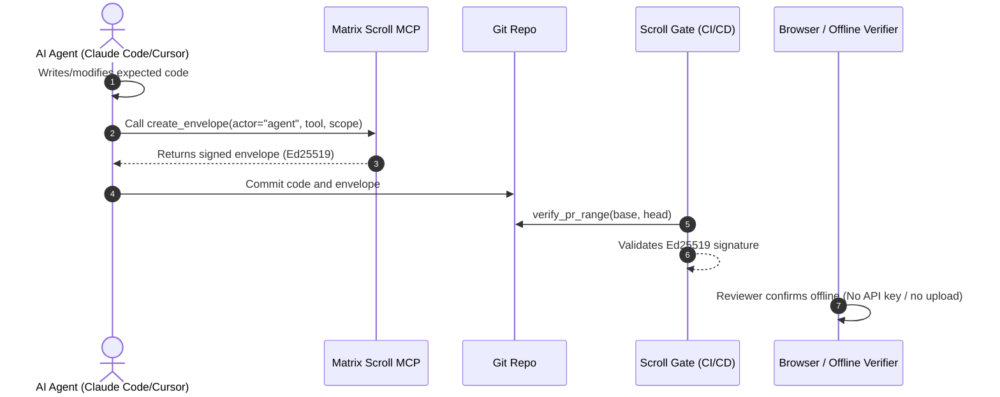

# Matrix Scroll

**Matrix Scroll is signed commit-time provenance for agent-assisted Git,
verified offline, with hardware as an optional preview trust upgrade.**

> [!IMPORTANT]
> **Compliance Mapping:** Matrix Scroll commit envelopes map directly to secure software supply chain and agentic AI traceability standards, including the **Five Eyes Joint Guidance on deploying AI systems (Apr 30)**, **EU AI Act Article 50 transparency requirements (Aug 2)**, and the **NIST SSDF (Secure Software Development Framework)**.

This repository is the canonical SDK, verifier contract, fixture set, and
release surface for the product.

---

## 🎬 Hero Demo: Agent Self-Attestation Loop

Watch an AI agent attest its own commits in-loop inside Claude Code or Cursor:



1. **Agent writes code** -> Modifies files in the workspace.
2. **Calls the Matrix Scroll MCP tool** -> Generates and signs a commit envelope with Ed25519 (`actor=agent`).
3. **Commit is created** -> Git saves the changes and the attestation envelope.
4. **Scroll Gate verifies the PR range** -> Ensures every commit in the PR is attested.
5. **Browser verifier confirms offline** -> Proof is audited client-side without external dependencies.

Run the self-attestation loop locally:
```bash
./examples/demo/hero-self-attestation-demo.sh
```

---

## Model Context Protocol (MCP) Server (Headline Install)

Matrix Scroll includes an optional Model Context Protocol (MCP) server that enables AI agents to sign their own commits in-loop. When Cursor or Claude Code performs an engineering task, they can attest their changes directly through the MCP server.

### Installation

Install the package with the optional `[mcp]` dependencies:
```bash
pip install "matrixscroll[mcp]"
```

### Running the Server

Start the MCP server over standard input/output (stdio):
```bash
python -m matrixscroll.mcp
```

### Exposed Tools

The server registers 6 Model Context Protocol tools focused strictly on agent self-attestation and range verification:

1. **`create_envelope(workspace: str, actor: str, tool: str, scope: str, message: str)`**: Builds, signs, and saves a commit envelope for staged changes or an existing commit using Ed25519.
2. **`verify_envelope(workspace: str, sha: str)`**: Cryptographically verifies a signed commit envelope's signature and integrity for a SHA.
3. **`verify_pr_range(workspace: str, base: str, head: str, source: str)`**: Verifies every commit in a given range (e.g., base..head) against validation policies.
4. **`envelope_publish_notes(workspace: str, base: str, head: str)`**: Publishes local commit envelopes to Git notes (`refs/notes/matrixscroll`) for transport.
5. **`status(workspace: str)`**: Retrieves status and details (public key, device ID, mode) of the active identity provider.
6. **`audit_export(workspace: str, base: str, head: str, output: str)`**: Exports a range of commit envelopes into a deterministic bundle directory for audit logs.

---

Matrix Scroll is a cryptographic evidence layer for Git. When an agent, CI
workflow, or human operator produces a commit, a signed commit envelope can
record the actor, tool, and optional bounded scope. Anyone can verify that
envelope locally, in CI, or in the browser without trusting the editor session
that produced it.

Keep GitHub Advanced Security, Semgrep, Snyk, branch protection, and artifact
attestations. Matrix Scroll adds signed commit-time authorship proof before
merge, and it keeps the same offline verification contract across the CLI,
browser, CI, and the SE050 preview path.

The reference SDK ships pure Ed25519 over canonical manifest bytes today. The
SSX360 / NXP SE050 path is the compatible next trust layer and remains a
preview path until device acceptance is complete.

## Honest limits

- Shipping now: PyPI `matrixscroll==0.2.6`, Git post-commit hooks,
  `matrixscroll envelope-verify`, Scroll Gate PR verification, browser
  verifier, the GitHub Action, and a USB CDC host transport preview for the
  SE050 rollout path. Emulated mode is the default evaluation path.
- In progress: RP2350 + SE050 firmware validation, external Ed25519-capable
  hardware key backends, and transparency-log integrations.
- Not: IAM, sandboxing, prompt filtering, or an agent runtime.

## Where it fits

- Scanners and branch protection catch code and policy issues; Matrix Scroll
  records who or what signed the change before push.
- Hardware keys and build attestations remain complementary roots and downstream
  proofs; Matrix Scroll covers commit-time provenance.
- The public contract stays pure Ed25519 over canonical manifest bytes,
  whether the signer is emulated today or hardware-backed later.

## Common questions

### What is Matrix Scroll and how does it secure Git?

Matrix Scroll is signed commit-time provenance for agent-assisted Git. It
secures Git by attaching an Ed25519-signed commit envelope to a commit,
recording the actor, tool, and optional bounded scope, then letting reviewers
verify that proof offline in the CLI, browser, or CI before merge.

### How do hardware and emulated modes differ in Matrix Scroll?

Emulated mode ships today and keeps the signing key on disk with owner-only
permissions so teams can evaluate the full workflow now. Hardware mode keeps
the same verifier contract and commit envelope schema, but moves the private
key into the SE050 secure element so the host cannot export it; that path
remains preview-only until device acceptance is complete.

### How can I integrate Matrix Scroll into a CI/CD workflow?

Install the SDK and hooks in your repo, publish commit envelopes to
`refs/notes/matrixscroll` before PR review, and use
`SSX360/matrixscroll-verify-action@v1` to verify the full PR commit range in
GitHub Actions. Protected branches can then require Matrix Scroll proof
alongside your existing scanners, branch protection, and build attestations.

## Alternative Setup: Raw CLI & Git Hooks

```bash
pip install "matrixscroll==0.2.6"
matrixscroll hook-install
matrixscroll hook-status

export MATRIXSCROLL_ACTOR_TYPE=agent
export MATRIXSCROLL_TOOL=agent-runner
git commit -m "feat: agent-assisted change"

matrixscroll envelope-verify "$(git rev-parse HEAD)"
```

See [`docs/quickstart-git.md`](docs/quickstart-git.md) and run
[`examples/demo/agent-commit-demo.sh`](examples/demo/agent-commit-demo.sh).

## CI verify

### Scroll Gate for a PR commit range

```yaml
- uses: actions/checkout@v4
  with:
    fetch-depth: 0
- uses: SSX360/matrixscroll-verify-action@v1
  with:
    head-ref: ${{ github.event.pull_request.head.sha }}
    base-ref: ${{ github.event.pull_request.base.sha }}
    source: notes
    matrixscroll-version: "0.2.6"
    require-mode: emulated
```

Publish envelopes to git notes before review:

```bash
matrixscroll envelope-publish-notes --base origin/main --head HEAD
git push origin refs/notes/matrixscroll
```

```yaml
- uses: actions/checkout@v4
  with:
    fetch-depth: 0
- uses: SSX360/matrixscroll-verify-action@v1
  with:
    head-ref: ${{ github.event.pull_request.head.sha }}
    base-ref: ${{ github.event.pull_request.base.sha }}
    source: notes
    matrixscroll-version: "0.2.6"
    summary-output: provenance-summary.json
```

See [`docs/quickstart-git.md`](docs/quickstart-git.md) and
[`examples/ci/protected-branch.yml`](examples/ci/protected-branch.yml).

The `--require-mode`, `--trusted-keys`, and actor or delegation policy checks
are available in the `0.2.x` line; the examples in this README pin `0.2.6`.

## Why it is different from Sigstore

Sigstore, GitHub artifact attestations, and SLSA answer "what was built in
CI?" Matrix Scroll answers "who signed this commit before push?" The systems
are complementary: Matrix Scroll signs commit envelopes at commit time, while
artifact-attestation systems sign build outputs later in the delivery chain.

Matrix Scroll does not compete with general authentication keys on their home
field. Existing hardware roots can become Matrix Scroll signing backends only
when they preserve the same pure Ed25519 byte contract.

## Public proof links

- Browser verifier: <https://matrixscroll.com/verify/>
- Compare page: <https://matrixscroll.com/compare/>
- Specification: [`SPEC.md`](SPEC.md)
- Commit envelope schema: [`schemas/commit-envelope.v1.json`](schemas/commit-envelope.v1.json)
- Whitepaper: [`docs/WHITEPAPER.md`](docs/WHITEPAPER.md)
- Conformance vectors: [`vectors/`](vectors/)
- GitHub Action: <https://github.com/SSX360/matrixscroll-verify-action>
- Agentic AI controls: [`docs/AGENTIC_AI_SECURITY.md`](docs/AGENTIC_AI_SECURITY.md)
- Site: <https://matrixscroll.com>
- Reference device path: [SSX360](https://matrixscroll.com/device)

## Python API

```bash
pip install "matrixscroll==0.2.6"
```

```python
import matrixscroll

print(matrixscroll.status())
# {'schema': 'matrixscroll.identity.v1', 'available': True,
#  'mode': 'emulated', 'device_id': 'MS-A3F2-9C81', ...}

signed = matrixscroll.sign_manifest({"release": "v1.0.0", "artifacts": [...]})

assert matrixscroll.verify_manifest(signed)
```

## CLI

```bash
$ matrixscroll status
{
  "available": true,
  "device_id": "MS-A3F2-9C81",
  "mode": "emulated",
  "public_key": "...",
  "schema": "matrixscroll.identity.v1"
}

$ matrixscroll sign release.json > release.signed.json
$ matrixscroll verify release.signed.json
{"device_id": "MS-A3F2-9C81", "mode": "emulated", "ok": true, "signed_at": "..."}
```

`matrixscroll verify` exits `0` on a valid signature and `2` on failure
(tampered manifest, missing signature block, wrong schema or algorithm,
mismatched device ID, malformed public key, unreadable file).

## How it works

```text
your IDE / agent / CI
         |
         |  commit envelope, release manifest, evidence pack, SBOM
         v
matrixscroll.sign_manifest(...)  /  post-commit hook
         |
         |  canonical JSON (sorted keys, ASCII-escaped, no NaN,
         |  signature block excluded from input)
         v
IdentityProvider          -->  Ed25519 signature
(L1 emulated today,
 SSX360 / SE050 roadmap)
         |
         v
signed document  -->  matrixscroll.verify_manifest(...)
                      (anyone, anywhere, offline)
```

Switch providers with `MATRIXSCROLL_MODE`. Hardware mode includes a USB CDC
host transport preview and a mock path for CI; real SE050 signing still
depends on device firmware validation. External-key backends stay out of the
mainline until they can sign the same canonical bytes with Ed25519.

For rollout order, start with `MATRIXSCROLL_MODE=emulated` for evaluation,
layer in external Ed25519-capable signers only when they stay verifier
compatible, and treat `hardware` as the SE050 preview path until device
acceptance is complete.

## Compliance levels

| Level | Provider | Backed by | Status |
| ----- | -------- | --------- | ------ |
| **L1** Emulated | `EmulatedProvider` | Software key, file-backed (0600) | Shipping |
| **L2** Hardware | `HardwareProvider` | NXP SE050 secure element (SSX360) | In progress |
| **L3** Attested | future | L2 + remote attestation | Roadmap |

`status()` exposes the active level via the `mode` and `available` fields.

## Storage and trust boundaries

- Emulated key store: `~/.matrixscroll/device.json`
  (override with `MATRIXSCROLL_HOME`).
- The directory is created `0700`; the seed file is opened `0600` with
  `O_CREAT|O_EXCL` so the private seed is never momentarily world-readable.
- A corrupt or truncated store fails loud (`IdentityError`) rather than
  silently minting a fresh identity.
- The planned hardware path holds nothing private on disk; the seed is sealed
  in the secure element.

## Reference implementation, not the only one

Matrix Scroll is a protocol. This Python package is the reference. We welcome
implementations in Rust, Go, TypeScript, and embedded C. Run them against
[`vectors/`](vectors/) to self-certify. See `CONTRIBUTING.md`.

## Agentic AI guidance proof

The repo includes a machine-readable control matrix at
[`controls/agentic_ai_controls.json`](controls/agentic_ai_controls.json), an
example bounded-agent evidence manifest at
[`examples/agentic_ai_evidence_manifest.json`](examples/agentic_ai_evidence_manifest.json),
and executable checks in `tests/test_agentic_guidance.py`.

## License

- Code: **Apache-2.0** (`LICENSE`).
- Specification text (`SPEC.md`, `vectors/`): **CC0 1.0** - public domain.

## Security

See [`SECURITY.md`](SECURITY.md). Report vulnerabilities privately to
**security@matrixscroll.com** or via a GitHub Security Advisory.
