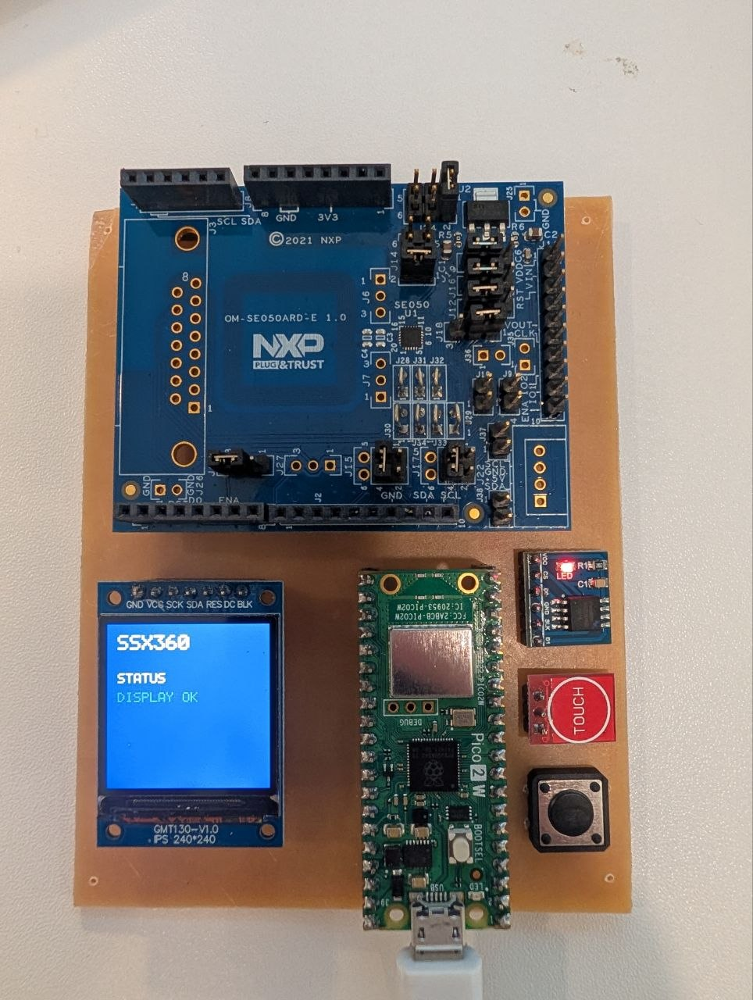
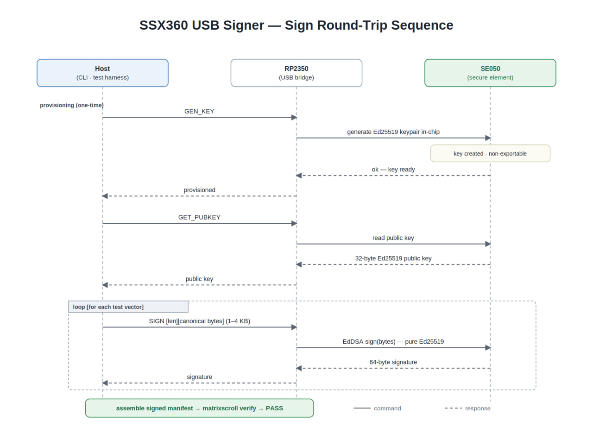
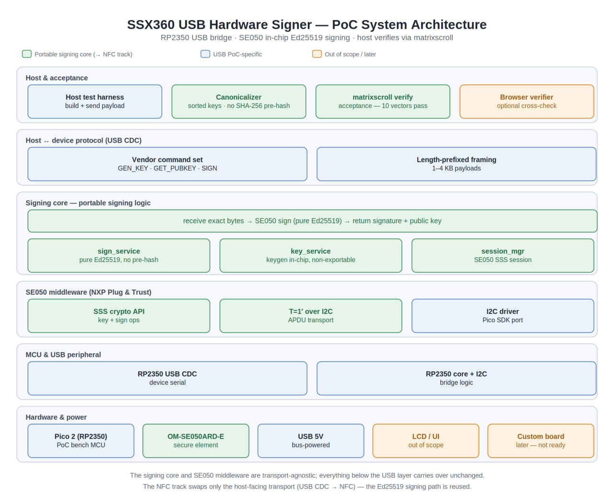

# SSX360 USB signer

SSX360 produces an RP2350 and NXP SE050 USB signer for Matrix Scroll. The Python host transport ships in `matrixscroll[hardware]==0.6.4`, and SSX360 supplies the physical signer through [SSX360 contact](https://ssx360.com/contact).



## What hardware mode does

- `MATRIXSCROLL_MODE=hardware` selects the SE050-backed provider.
- The RP2350 carries commands between the host and the SE050 over USB CDC.
- The SE050 creates the Ed25519 key pair and keeps the private key non-exportable.
- The host receives the public key and detached signature.
- The standard Matrix Scroll verifier checks the result offline.

Hardware mode preserves the canonical-byte and signature contract used by the file-backed provider.

## Install and connect

```bash
pip install "matrixscroll[hardware]==0.6.4"
export MATRIXSCROLL_MODE=hardware
export MATRIXSCROLL_SE050_PORT=/dev/ttyACM0
matrixscroll status
```

On Windows PowerShell:

```powershell
$env:MATRIXSCROLL_MODE = "hardware"
$env:MATRIXSCROLL_SE050_PORT = "COM3"
matrixscroll status
```

Use the serial port assigned to the device. `COM3` and `/dev/ttyACM0` are examples.

## Connect through MCP

Install both extras:

```bash
pip install "matrixscroll[mcp,hardware]==0.6.4"
```

Pass the provider settings to the stdio server:

```json
{
  "mcpServers": {
    "matrixscroll": {
      "command": "matrixscroll-mcp",
      "args": [],
      "env": {
        "MATRIXSCROLL_MODE": "hardware",
        "MATRIXSCROLL_SE050_PORT": "COM3"
      }
    }
  }
}
```

Call `connect_card` to probe the USB CDC bridge. Call `status` before signing to confirm that the hardware provider is active.

## Device components

| Component | Detail |
| --- | --- |
| MCU and USB bridge | Raspberry Pi Pico 2 W with RP2350 |
| Secure element | NXP SE050 on OM-SE050ARD-E |
| Display | GMT130-V1.0 IPS 240 x 240 ST7789 |
| Display pins | SCK18 MOSI19 CS17 DC20 RST21 BL16, SPI mode 3 |
| Protocol | `ssx360.se050.poc.v1` |

## Signing sequence



1. The host sends `GEN_KEY` to the RP2350 bridge.
2. The SE050 creates the Ed25519 key pair.
3. The host reads the 32-byte public key.
4. The host sends canonical bytes with `SIGN`.
5. The SE050 returns a 64-byte Ed25519 signature.
6. Matrix Scroll assembles and verifies the signed record.



## Environment variables

| Variable | Purpose |
| --- | --- |
| `MATRIXSCROLL_MODE=hardware` | Select the hardware provider |
| `MATRIXSCROLL_SE050_MOCK=1` | Use the in-process transport in development or CI |
| `MATRIXSCROLL_SE050_PORT` | Set the USB CDC serial device path |
| `MATRIXSCROLL_SE050_BAUD` | Override the default `115200` baud rate |
| `MATRIXSCROLL_SE050_TIMEOUT_MS` | Override the default `3000` millisecond timeout |

## Availability and limits

SSX360 supplies the physical signer through direct contact. PyPI distributes the host software and cannot supply hardware. The signer is not listed for self-service purchase.

The secure element protects key custody. It does not establish who is authorized to use the device. Register the expected public key, control physical access, and define a revocation process before enforcing hardware signatures.

The wire protocol is documented in [`SE050_USB_PROTOCOL.md`](SE050_USB_PROTOCOL.md). The original acceptance scope remains in [`SE050_POC_SCOPE.md`](SE050_POC_SCOPE.md).
